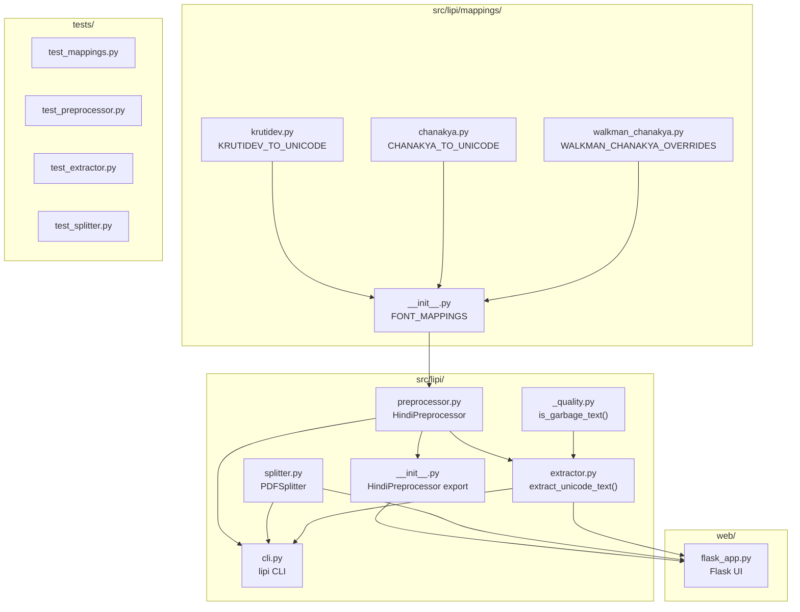
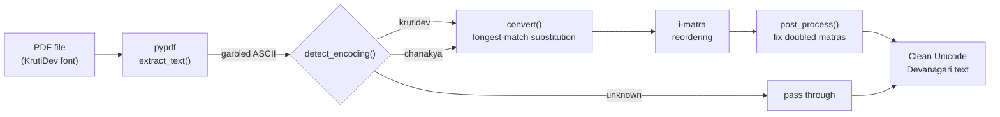
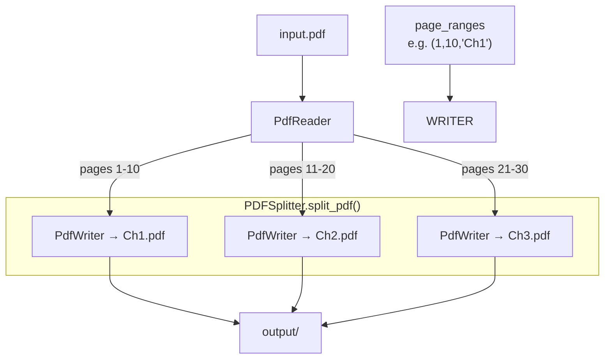
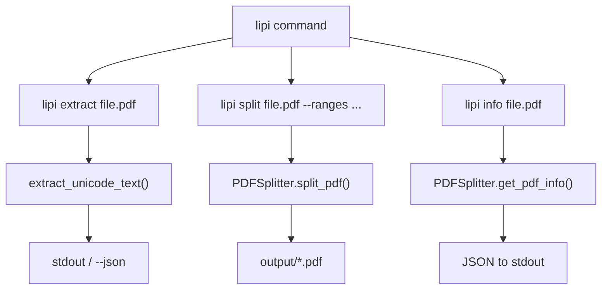
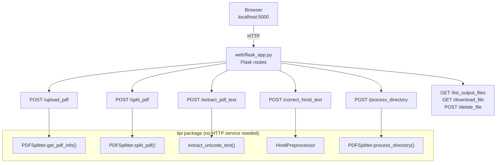
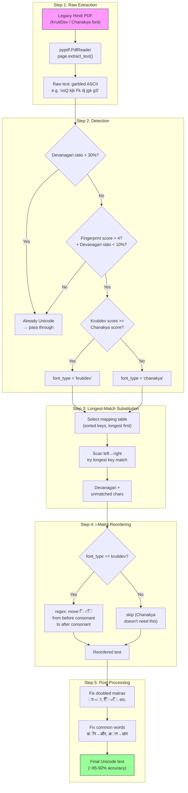
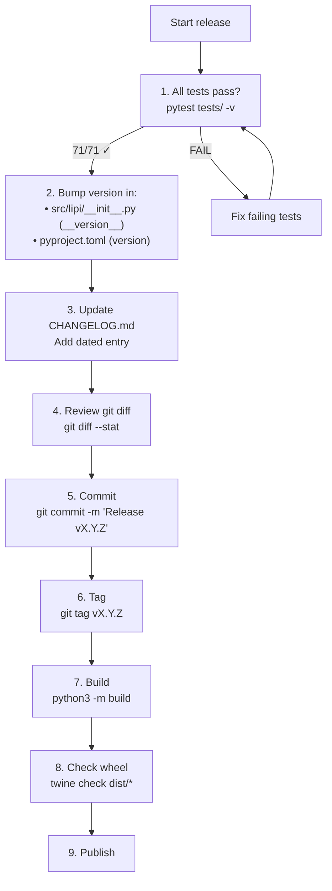
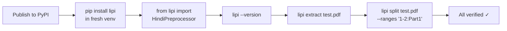
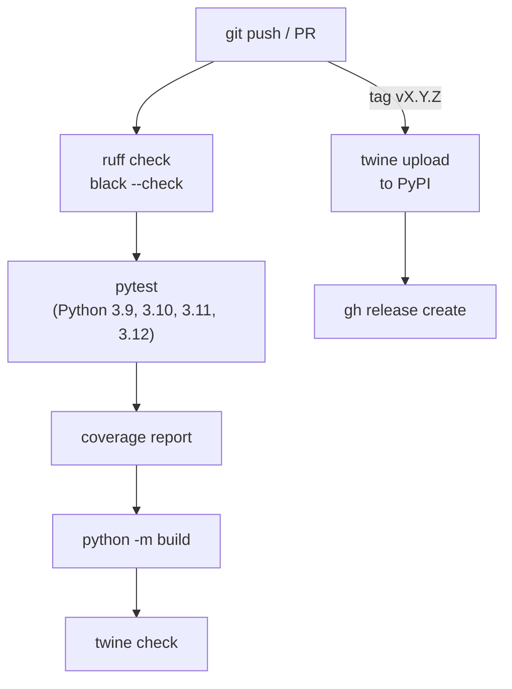

# Lipi — Publishing & Operations Guide

> Internal reference for the Aparsoft team.  Covers the full lifecycle: from
> local development to PyPI publish, including workflow diagrams for every
> major usage path.

---

## Table of Contents

1. [Repository Structure](#1-repository-structure)
2. [Package Layout Diagram](#2-package-layout-diagram)
3. [Development Setup](#3-development-setup)
4. [Running Tests](#4-running-tests)
5. [Usage Workflows](#5-usage-workflows)
   - 5.1 [Python Library — Text Extraction](#51-python-library--text-extraction)
   - 5.2 [Python Library — PDF Splitting](#52-python-library--pdf-splitting)
   - 5.3 [CLI](#53-cli)
   - 5.4 [Flask Web UI](#54-flask-web-ui)
6. [Hindi Encoding Pipeline (Deep Dive)](#6-hindi-encoding-pipeline-deep-dive)
7. [Version Bump Checklist](#7-version-bump-checklist)
8. [Building the Package](#8-building-the-package)
9. [Publishing to PyPI](#9-publishing-to-pypi)
10. [Publishing to TestPyPI (dry run)](#10-publishing-to-testpypi-dry-run)
11. [Post-Publish Verification](#11-post-publish-verification)
12. [GitHub Release](#12-github-release)
13. [CI/CD (Future)](#13-cicd-future)
14. [Troubleshooting](#14-troubleshooting)

---

## 1. Repository Structure

```
lipi/                                  # repo root
├── src/lipi/                          # installable package
│   ├── __init__.py                    # public API, __version__
│   ├── preprocessor.py                # HindiPreprocessor class
│   ├── extractor.py                   # extract_unicode_text()
│   ├── splitter.py                    # PDFSplitter class
│   ├── cli.py                         # argparse CLI (lipi command)
│   ├── _quality.py                    # is_garbage_text()
│   └── mappings/
│       ├── __init__.py                # FONT_MAPPINGS (merged)
│       ├── krutidev.py                # base KrutiDev table
│       ├── chanakya.py                # Chanakya table
│       └── walkman_chanakya.py        # Walkman-Chanakya905 overrides
├── web/
│   ├── flask_app.py                   # Flask web UI
│   └── templates/                     # Jinja2 HTML templates
├── tests/
│   ├── __init__.py
│   ├── test_mappings.py               # 15 tests
│   ├── test_preprocessor.py           # 28 tests
│   ├── test_extractor.py              # 8 tests
│   └── test_splitter.py               # 20 tests
├── hindi_preprocessor.py              # backward-compat shim
├── pdf_cutter_service.py              # backward-compat shim
├── pyproject.toml                     # package metadata + build config
├── README.md                          # public docs
├── CONTRIBUTING.md                    # how to contribute
├── CHANGELOG.md                       # version history
├── PUBLISHING.md                      # this file
├── config.example.json                # batch config template
└── LICENSE                            # MIT
```

---

## 2. Package Layout Diagram



---

## 3. Development Setup

```bash
# 1. Clone
git clone https://github.com/aparsoft/lipi.git
cd lipi

# 2. Create virtualenv (recommended)
python3 -m venv .venv
source .venv/bin/activate

# 3. Install in editable mode with dev deps
pip install -e ".[dev]"

# 4. Verify
python3 -c "from lipi import HindiPreprocessor; print('OK')"
lipi --version
```

### Dependency groups

| Extra | Includes | Use case |
|-------|----------|----------|
| (none) | `pypdf>=4.0` | Core library |
| `fitz` | `PyMuPDF>=1.24` | Font-name-based span extraction |
| `flask` | `Flask`, `watchdog`, `tqdm`, `requests` | Web UI |
| `dev` | `pytest`, `pytest-cov`, `black`, `ruff` | Development |

---

## 4. Running Tests

```bash
# All tests
pytest

# With coverage
pytest --cov=lipi --cov-report=term-missing -v

# Specific file
pytest tests/test_preprocessor.py -v

# Lint
ruff check src/lipi/
black --check src/lipi/
```

### Current test coverage (71 tests)

| Test file | Count | Covers |
|-----------|-------|--------|
| `test_mappings.py` | 15 | Table loading, merging, Walkman overrides, value validation |
| `test_preprocessor.py` | 28 | Detection, conversion, i-matra reordering, post-process, get_mapping |
| `test_extractor.py` | 8 | Quality gate, file-not-found, font_type=none |
| `test_splitter.py` | 20 | Parse ranges, config validation, split files, PDF info |

---

## 5. Usage Workflows

### 5.1 Python Library — Text Extraction



```python
from lipi.extractor import extract_unicode_text

result = extract_unicode_text("hindi_textbook.pdf")
print(result["full_text"])           # Unicode Devanagari
print(result["has_encoding_issues"]) # True/False
print(result["detected_font_type"])  # "krutidev" / "chanakya" / "unknown"
```

### 5.2 Python Library — PDF Splitting



```python
from lipi.splitter import PDFSplitter

files = PDFSplitter.split_pdf(
    "textbook.pdf", "chapters/",
    [(1, 10, "Chapter1"), (11, 20, "Chapter2")],
    prefix="HindiTextbook",
)
```

### 5.3 CLI



```bash
lipi extract hindi_textbook.pdf                    # print extracted text
lipi extract hindi_textbook.pdf --json              # full JSON output
lipi extract hindi_textbook.pdf --page-range 1-5    # specific pages
lipi split book.pdf --ranges "1-10:Ch1,11-20:Ch2"
lipi info hindi_textbook.pdf
```

### 5.4 Flask Web UI



```bash
# Start the web UI
pip install "lipi[flask]"
python web/flask_app.py
# → http://localhost:5000
```

The Flask app calls the `lipi` package directly — no background HTTP service is
required.  All routes use `HindiPreprocessor`, `PDFSplitter`, and
`extract_unicode_text()` in-process.

---

## 6. Hindi Encoding Pipeline (Deep Dive)



---

## 7. Version Bump Checklist

Before every release, go through this list:



### Step-by-step

1. **Run tests** — `pytest tests/ -v` (all 71 must pass)
2. **Bump version** in two places:
   - `src/lipi/__init__.py` — `__version__ = "X.Y.Z"`
   - `pyproject.toml` — `version = "X.Y.Z"`
3. **Update CHANGELOG.md** — add entry under `## [X.Y.Z] - YYYY-MM-DD`
4. **Review changes** — `git diff --stat` and `git log --oneline`
5. **Commit** — `git add -A && git commit -m "Release vX.Y.Z"`
6. **Tag** — `git tag -a vX.Y.Z -m "Release vX.Y.Z"`
7. **Build** — see [Section 8](#8-building-the-package)
8. **Publish** — see [Section 9](#9-publishing-to-pypi)

### Version numbering rules

- **Patch** `1.0.1` — bug fixes, mapping corrections
- **Minor** `1.1.0` — new features (new font mapping, new CLI command)
- **Major** `2.0.0` — breaking API changes

---

## 8. Building the Package

```bash
# Install build tools
pip install build twine

# Clean old builds
rm -rf dist/ *.egg-info/

# Build sdist + wheel
python3 -m build

# This creates:
#   dist/lipi-X.Y.Z.tar.gz     (source distribution)
#   dist/lipi-X.Y.Z-py3-none-any.whl  (universal wheel)

# Verify the package
twine check dist/*

# Inspect contents (optional)
python3 -m zipfile -l dist/lipi-X.Y.Z-py3-none-any.whl
```

---

## 9. Publishing to PyPI

```bash
# First time: create API token at https://pypi.org/manage/account/token/
# Save it as: ~/.pypirc or pass via --username/__token__

# Upload to PyPI
twine upload dist/*

# You'll be prompted for credentials.
# Username: __token__
# Password: pypi-... (your API token)
```

After publishing, anyone can:

```bash
pip install lipi
```

---

## 10. Publishing to TestPyPI (dry run)

Always test here first before the real PyPI:

```bash
# Upload to TestPyPI
twine upload --repository testpypi dist/*

# Install from TestPyPI to verify
pip install --index-url https://test.pypi.org/simple/ --extra-index-url https://pypi.org/simple/ lipi

# Verify
python3 -c "from lipi import HindiPreprocessor; print(HindiPreprocessor.convert('osQ', font_type='krutidev'))"
# → के
```

---

## 11. Post-Publish Verification



```bash
# In a fresh virtualenv
python3 -m venv /tmp/lipi-test
source /tmp/lipi-test/bin/activate

pip install lipi

# Verify core import
python3 -c "from lipi import HindiPreprocessor; print('Core OK')"

# Verify CLI
lipi --version

# Verify extraction (if you have a test PDF)
lipi extract path/to/hindi_textbook.pdf --page-range 1-1

# Verify optional deps
pip install "lipi[flask]"
python3 -c "from lipi.splitter import PDFSplitter; print('Splitter OK')"
```

---

## 12. GitHub Release

After PyPI publish:

```bash
# Push commit + tag
git push origin main
git push origin vX.Y.Z

# Create GitHub release
gh release create vX.Y.Z \
  --title "vX.Y.Z" \
  --notes "$(cat CHANGELOG.md | head -30)" \
  dist/lipi-X.Y.Z.tar.gz \
  dist/lipi-X.Y.Z-py3-none-any.whl
```

---

## 13. CI/CD (Future)

Recommended GitHub Actions workflow:



Create `.github/workflows/ci.yml`:

```yaml
name: CI
on: [push, pull_request]
jobs:
  test:
    runs-on: ubuntu-latest
    strategy:
      matrix:
        python-version: ["3.9", "3.10", "3.11", "3.12"]
    steps:
      - uses: actions/checkout@v4
      - uses: actions/setup-python@v5
        with:
          python-version: ${{ matrix.python-version }}
      - run: pip install -e ".[dev]"
      - run: pytest tests/ -v
      - run: ruff check src/lipi/

  publish:
    if: startsWith(github.ref, 'refs/tags/v')
    needs: test
    runs-on: ubuntu-latest
    steps:
      - uses: actions/checkout@v4
      - uses: actions/setup-python@v5
        with:
          python-version: "3.12"
      - run: pip install build twine
      - run: python3 -m build
      - run: twine check dist/*
      - run: twine upload dist/*
        env:
          TWINE_USERNAME: __token__
          TWINE_PASSWORD: ${{ secrets.PYPI_API_TOKEN }}
```

---

## 14. Troubleshooting

| Problem | Fix |
|---------|-----|
| `ModuleNotFoundError: No module named 'lipi'` | Run `pip install -e .` in the repo root |
| `setuptools.backends` import error | Use `build-backend = "setuptools.build_meta"` in pyproject.toml |
| SyntaxError in krutidev.py | The double-quote key `"` must use `'"'` syntax or Unicode escapes — avoid curly quotes |
| `pip install -e .` fails with PEP 668 | Use a venv, or add `--break-system-packages` (not recommended) |
| Tests fail after mapping changes | Clear `HindiPreprocessor._sorted_keys` cache — or just restart the Python process |
| `twine upload` fails with 403 | Verify your PyPI API token has the right scope and hasn't expired |
| `lipi` command not found after install | Check `pip show lipi` to see where it installed; ensure Scripts/ dir is on PATH |
| Flask app can't find templates | `web/flask_app.py` uses `template_folder=` pointing to `web/templates/` — run from repo root |
| Conversion accuracy is low for a specific PDF | The font may use variant glyphs not in our mapping. Extract a sample and add entries to the appropriate mapping file. |

---

## Quick Reference Card

```
# Dev setup
pip install -e ".[dev]"

# Test
pytest tests/ -v

# Build
python3 -m build

# Publish (dry run)
twine upload --repository testpypi dist/*

# Publish (real)
twine upload dist/*

# Post-verify
pip install lipi && lipi --version

# Tag + release
git tag -a vX.Y.Z -m "Release vX.Y.Z"
git push origin main --tags
gh release create vX.Y.Z dist/*
```
